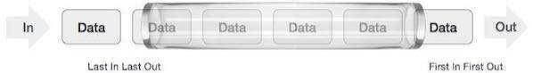
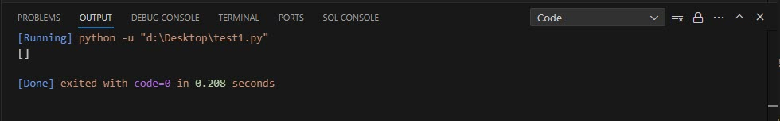
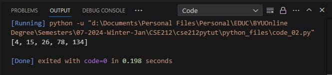
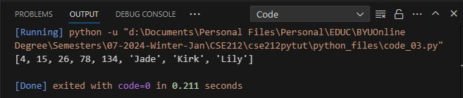
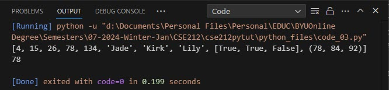
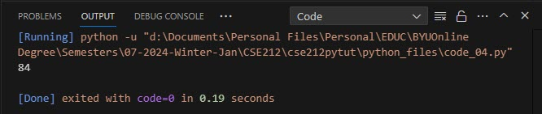
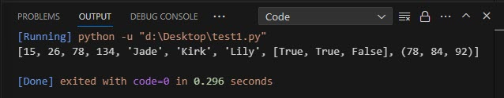
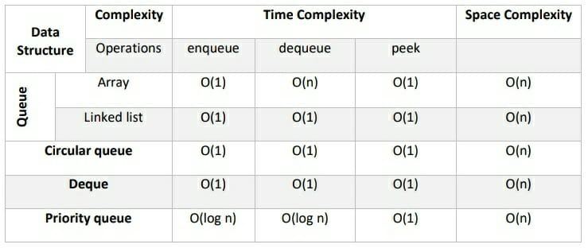

# Queues

None of us are strangers to queues. We see and stand in them in the supermarkets, bus-stops, train stations, theatre houses, cinemas, fast-food eatries, and many more. Queues are are part of our every day lives.

Don't be surprised that in computing, we have a data structure that not only bears the same name as the queues we are already familiar with, but, it also shares the same characteristics. So, using the example of our day-to-day queues, let's examine those characteristics.

## Characteristics of a Queue


- Every queue has two ends
- People enter a queue at one end
- People exit a queue at the other end

Let's now compare these characteristics to a data structure queue. In a data structure queue,



- Every queue also has two ends
- Data enters the queue from one end, and
- Data exist the queue from the other end

A queue is a data structure referred to as a FIFO (First In First Out), i.e. the first data that enters is the first also to exist it. Contents of a queue data structure are referred to as elements.

## Practical Uses of a Queue

A queue can be used for a wide variety of tasks and operations. These includes, but are not limited to:

- Call center management
- Job scheduling
- Data buffers
- Message queues/passing
- Printer spooling
- Process scheduling
- Breadth First Search (BFS)
- CPU task management, and many more

## Basic Operations of a Queue

These are the operations that can be carried out on a queue, namely:

- enqueue(): Adds an element to the end of a queue.
- dequeue(): Removes an element to the end of a queue.
- peek(Front): View the element at the front of the queue _without_ removing it.
- peek(Rear): View the element at the rear of the queue _without_ removing it.
- size(): Return the size of the queue.
- empty(): Returns true if the length of the queue is zero.

We shall take a look at these operations in greater detail in this tutorial.

## Types of Queues

There are different types of queues that can be implemented in Python depending on its purpose and use.

1. Simple Queue: In this queue, elements are inserted at the rear end (i.e. enqueue) and removed at the front end (i.e. dequeue). It is also referred to as a linear queue.

2. Circular Queue: In this queue, its elements act like circular rings. This queue is similar to the simple queue with the exception that the last element is connected to the first element so the queue is like a ring. This queue has the advantage of better utilized memory.

3. Priority Queue: Its elements are stored in the order of their priority and not in the order in which they entered the queue. They can also be in ascending or descending order.

4. Dequeue (not to be confused the the dequeue operation): This is a double-ended queue. Elements can be inserted and removed from both ends of the queue. Because of this manner of operation, a dequeue may not follow the first-in-first-out process.

5. Blocking Queue: This type supports operations that block the queue when necessary.

6. Concurrent Queue: This type of queue is designed for multi-threaded applications.

## Implementing a queue in Python

Queues can be implemented in Python by using arrays, lists, or linked lists. When arrays are used, the size of the queue is fixed, but dynamic when lists or linked lists is used.

We shall now examine queue operations in Python in greater detail. In practising these codes, remember they are cumulative i.e. each new chunk of code builds on the previous. So, remember to include the previous codes when testing new codes except where so indicated.

### Creating a queue

We create a queue by using the [] brackets.

```python
# create a queue named myQueue - code01.py
myQueue = []

```

The above code creates a queue named myQueue with no elements in it.

```python
# create a queue named myQueue
myQueue = []
print(myQueue)
```



### Adding elements to a queue (Enqueue)

Now that we have created our queue, let us try adding some elements to it. We add elements to a queue by using the .append(value) method. So, to add a value to our myQueue, we would write:

```python
myQueue.append(value)
```

Let's add the values 4, 15, 26, 78, 134 to our queue.

```python
# create a queue named myQueue - code02.py
myQueue = []

# add the values 4, 15, 26, 78, 134 to myQueue
myQueue.append(4)
myQueue.append(15)
myQueue.append(26)
myQueue.append(78)
myQueue.append(134)

print(myQueue)
```



Try adding two elements _at the same time_ to the queue (e.g. myQueue.append(4, 15)). What result did you get? Remember the example of a day-today queue? Even of two or more people arrive at the same time, they would still have to line up one after the other. You add elements to a queue one at a time.

We have added numbers to our queue. Now let's try adding the list of our pets to our queue and display the contents of the queue.

```python
# create a queue, myQueue, with our elements - code03.py
myQueue = [4, 15, 26, 78, 134]

# add our pet names - 'Jade', 'Kirk', 'Lily' to myQueue
myQueue.append("Jade")
myQueue.append("Kirk")
myQueue.append("Lily")

print(myQueue)
```



You can see that our action was successful. Our pet names, though strings, were added to the queue even though our earlier contents were numbers. This is because a queue is heterogenous i.e. it can accept more than one data type. Take a look at the first line of code. In the previous example, we created an empty queue first before adding items to it. In this line of code, we carried out both actions - creating and adding elements- at the same time in one single line of code. Practice adding other data types into the queue.

### Accessing elements in a queue

Take a look at the output of our queue displayed below. How many elements are in the queue?



Before we reveal the answer, the question you have just been asked is simply asking what is the length or size of the queue. The length or size of a queue is equal to the number of elements in the queue. So, let's try that.

#### Finding the size (or number of elements) in a queue

```python
# create the queue with the various elements in it - code04.py
myQueue = [4, 15, 26, 78, 134, "Jade", "Kirk", "Lily", [True, True, False], (78, 84, 92)]

# assign the size of the queue using len(queue_name) to a variable
queueSize = len(myQueue)

# print the size of the queue
print('The size of myQueue is {}'.format(queueSize))
```

Did you get the answer right? 10? If you did, well done! If you didn't, don't worry, you about to understand why with this explanation. let's go back to the display of the queue elements.

Take a good look and count only those elements that are separated by a stand-alone comma. Do not count commas that are inside of any form of brackets. Remember to add the last element even though it does not have a comma after it.

Queues can hold all forms of data. Each element in a queue is separated by a comma. So, in our sample queue, we 5 number elements (4, 15, 26, 78, 134), 3 string elements ("Jade", "Kirk", "Lily"), 1 list ([True, True, False]), and a tuple (78, 84, 92) making 10 elements. We shall now return to how to access these elements.

As in arrays, elements in a queue are accessed using an index. The index starts at 0 and increase by 1 up to the size (length) of the queue minus 1. So,in the example of our queue, its indexes will be 0, 1, 2, 3, 4, 5, 6, 7, 8, 9. Elements in indexes 0 to 7 are single elements. Elements at index 8 and 9 are not. So, how do we access the members of this element?

Did you guessed it? If you said we add another index, are correct. The same rules of 0 to the size minus 1 also applies to sub-elements of a queue.

What code will you use to access sub-element 84 in the last element in our queue? What is the index of the last element (tuple) in the queue? (9). What is the index of sub-element 84? (1). Let's now print that element.

```python
# create the queue with the various elements in it
myQueue = [4, 15, 26, 78, 134, "Jade", "Kirk", "Lily", [True, True, False], (78, 84, 92)]

print(myQueue[9][1])
```



### Remove elements from a queue (Dequeue)

As mentioned earlier, elements can only be removed from our simple, linear queue from the front end. this can can done in two ways:

(a) either by removing and returning the item from the fron tof the queue, or (b) by popping off the element at index 0. Let's examine both.

```python
# removing and returning the item from the front of the queue
myQueue = [4, 15, 26, 78, 134, "Jade", "Kirk", "Lily", [True, True, False], (78, 84, 92)]

# return the item in the front of the queue
front_element = myQueue[0]

# removing the element at index 0
del myQueue[0]

print(myQueue)
```



## Complexity

Complexity defines how easy or difficult a problem or a solution is. It is measured in two ways: (a) time complexity, and (b) space complexity. Time complexity measure the time it takes to execute an operation on a data structure, while space complexity messures the amount of storage or memory space it takes to store the data structure. The complexity of a queue is shown in the table below:


Courtesy: [Devopedia](https://devopedia.org/queue-data-structure#:~:text=complexity%20of%20queues.-,Source%3A%20Devopedia%202022.,the%20rear%20pointer%20is%20updated.)

The above table shows the worst-case scenarios for each queue operation.

## A Sample Solution

In the example below a queue is used in implement a shopping cart menu. Users are presented with a menu where they can add items to the cart, view the cart, remove an item from the card and checkout the cart.

```python
# clear the screen
# import os
import time
# os.system("cls")
time.sleep(1)

# Define the menu as a function
def menu():
    print()
    print('Welcome to the Shopping Cart Program!')
    print()
    print('Please select one of the following:')
    print('1.  Add item')
    print('2.  View cart')
    print('3.  Remove item')
    print('4.  Compute total')
    print('5.  Quit')
    print()

# print the shopping cart list
def print_lists():
    print()
    print('The contents of the shopping cart are:')
    indx = 1
    for item in range(len(cart_list)):
        indx = item + 1
        item_name = cart_list[item]
        item_price = cart_list_price[item]
        print(f'{indx}.  {item_name.capitalize()} - ${item_price:.2f}')

# create a list for the shopping cart and for prices of items
cart_list = []
cart_list_price = []

# display menu option; evaluate options
menu_opt = 0
while menu_opt != 5:
    menu()

    valid_menu = False
    while not valid_menu:
        try:
            menu_opt = int(input('Please enter an action (1-5): '))
            if menu_opt > 0 and menu_opt < 6:
                valid_menu = True
        except ValueError:
            print('\033[1;33;40mSorry, incorrect entry. Please try again.\033[0;37;48m')
            continue

    # menu option 1 -- add items to the shopping cart list
    if menu_opt == 1:
        more_items = True
        print()
        while more_items:
            new_item = input('What item would you like to add? Type "end" to exit:  ')
            if new_item.lower() != 'end':
                price_invalid = True
                while price_invalid:
                    try:
                        new_item_price = float(input('What is the price of ' + new_item + '?  '))
                        price_invalid = False
                    except ValueError:
                        print('\033[1;33;40mSorry, invalid price entry. Please try again.\033[0;37;48m')
                        continue
                cart_list.append(new_item)
                cart_list_price.append(new_item_price)
                print(f'\033[1;32;40m{new_item}\033[0;37;48m at \033[1;32;40m${new_item_price:.2f}\033[0;37;48m has been added to the list.')
                print()
            else:
                more_items = False

    # menu option 2 -- view cart items
    elif menu_opt == 2:
        if cart_list != []:
            print_lists()
        else:
            print('\033[1;33;40mYour shopping cart list is empty.\033[0;37;48m')

    # menu option 3 -- remove cart items
    elif menu_opt == 3:
        if cart_list != []:
            print_lists()
            print()

            # request option to amend; validate input
            input_not_valid = True
            while input_not_valid:
                try:
                    upd_indx = int(input('Which item would you like to remove? '))
                    upd_indx -= 1
                    if upd_indx not in range(len(cart_list)):
                        print('\033[1;33;40mSorry, that is not a valid item number.\033[0;37;48m')
                    input_not_valid = False
                    # delete items from lists
                    del_name = cart_list[upd_indx]
                    cart_list.pop(upd_indx)
                    cart_list_price.pop(upd_indx)
                    print(f'{del_name.capitalize()} has been \033[1;31;40m deleted \033[0;37;48m')
                    print()
                except ValueError:
                    print('\033[1;33;40mSorry, invalid entry. Please try again.\033[0;37;48m')
                    continue
        else:
            print('\033[1;33;40mYour shopping cart list is empty.\033[0;37;48m')

    # menu option 4 -- checkout the cart
    elif menu_opt == 4:
        if cart_list != []:
            print()
            list_total = sum(cart_list_price)
            print(f'The total price of the items in the shopping cart is ${list_total:.2f}')
        else:
            print('\033[1;33;40mYour shopping cart list is empty.\033[0;37;48m')
        print()

    elif menu_opt ==5:
        # menu option 5 -- exit the program
        print()
        print('Thank you. Goodbye.')

    else:
        print('\033[1;33;40mInvalid option. Select 1 through 5.\033[0;37;48m')
```

## Summary

A queue is an abstract data type that follows the first-in, first-out (FIFO) principle, where the first element added to the queue is the first one processed and removed. Queues have two ends - front and rear. New elements are inserted at the rear and removed from the front.

Queues can be implemented as linear or circular, bounded or unbounded, using arrays or linked lists. Variations like deque and priority queue are not strictly FIFO queues and serve different purposes.
A real-world example of a queue is people lining up to buy train tickets at a counter. The first person in line is served first, then exits the queue. New people joining the line are added to the end of the queue

In application as a data structure, queues can be used for:

- Hardware and real-time system interrupts
- Loop over the list of processes by an operating system
- Handle data buffering such as in the playlist in a music or video \* player
- Used in routers and switches to process data packets
- System disk scheduling, memory management, semaphores, I/O buffers, file access requests,
- And many more.

The worst-case space complexity of a queue is O(n) since all its elements must be stored and the worst-case time complexity is O(1) since only an element is inserted at the rear end and the pointer is updated.

## Exercises

Given a positive number n, efficiently generate binary numbers between 1 and n using the queue data structure in linear time.

#### Solution to the exercise

<details open>
<summary>Click only after attempting the exercise.</summary>

```python
from collections import deque
 
 
# Function to generate binary numbers between 1 and `n` using the
# queue data structure
def generate(n):
 
    # create an empty queue and enqueue 1
    q = deque()
    q.append('1')
 
    # run `n` times
    for i in range(n):
        # remove the front element
        front = str(q.popleft())
 
        # append 0 and 1 to the front element of the queue and
        # enqueue both strings
        q.append(front + '0')
        q.append(front + '1')
 
        # print the front element
        print(front, end=' ')
 
 
if __name__ == '__main__':
 
    n = 16
    generate(n)
```

</details>


## Further Reading

- [Porter, Riley. 2017. "Pseudocode, ADTs, Priority Queues, Heaps." CSE 373: Data Structures & Algorithms, Winter 2017, University of Washington. Accessed 2022-02-24.](https://courses.cs.washington.edu/courses/cse373/17wi/lectures/priority-queues.pdf)
- [Wikipedia. 2021. "Data Structures/Stacks and Queues" Wikipedia. Updated 2020-09-20. Accessed 2022-02-24.](https://en.wikibooks.org/wiki/Data_Structures/Stacks_and_Queues)
- [TutorialsPoint, Queue Data Structure.](https://www.tutorialspoint.com/data_structures_algorithms/dsa_queue.htm)
