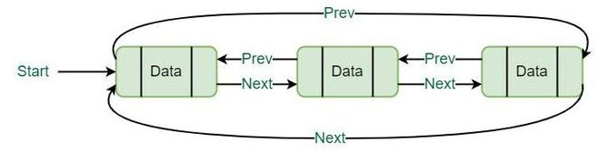
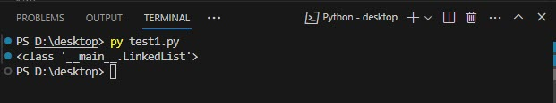
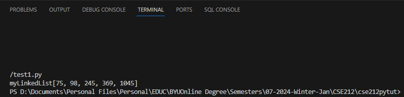

# Linked Lists

Every one of us has created and or used a list (of items) at one time of the other. From that perspective, we can define a list as a number of related items that are written or printed consecutively one after the other. With respect to data structures, a linked list can be defined as a liner, dynamic, non-homogenous data structure that stores a sequence of elements.

## Characteristics of Linked Lists

- Each item in a linked list is referred to as a node
- The first node in a linked list is called the head
- The last node in a linked list is called the tail
- Each node consist of a data value and one or two pointers depending on the type of linked list
- Linked lists nodes are not stored in sequential memory locations. Instead, they are stored in different memory locations and pointers are used to indicate their locations.
- Linked list is dynamic meaning that its size is not fixed.
- Linked lists can be used to implement other data structure such as graph, stack, queue, hash, and others.

## Types of Linked Lists

There are four major types of linked lists.


Courtesy: [Simplilearn.com](https://www.simplilearn.com/tutorials/data-structure-tutorial/types-of-linked-list#:~:text=A%20linked%20list%20is%20a,list%20is%20called%20the%20tail.)

1. Singly linked lists: This consist of nodes with each node having a pointer to the next node. The tail node in the list has a null pointer.
2. Doubly likend lists: Each node in this list have two pointers - one pointing to the previous node and the other pointing to the next node. The previous pointer of the head node and the next pointer of the tail node in this list points to null.
3. Circular linked lists: This is similar to a doubly linked list with the exception that next pointer of the tail node point back to the head node.
4. Circular doubly linked lists: Again similar to the circular linked list but the the addition that the previous pointer of the head node points back to the tail node.


Singly linked lists (source: [tutorialspoint](https://www.tutorialspoint.com/data_structures_algorithms/linked_list_algorithms.htm) )


Doubly linked lists (source: [tutorialspoint](https://www.tutorialspoint.com/data_structures_algorithms/linked_list_algorithms.htm) )


Circular linked lists (source: [tutorialspoint](https://www.tutorialspoint.com/data_structures_algorithms/linked_list_algorithms.htm) )


Circular Doubly linked lists (source: [geeksforgeeks](https://www.geeksforgeeks.org/introduction-to-circular-doubly-linked-list/) )


**For the purpose of this tutorial, we shall be focussing on the doubly linked lists. Reading references to the other types of linked lists will be provided at the end of this tutorial.**

## Practical Uses of Linked Lists in Computer Science

- Representing sparse matrices.
- Manipulation of polynomials by storing constants in the node of the linked list.
- Implementation of graphs (such as in storing adjacent vertices).
- Dynamic memory allocation.
- Maintaining a directory of names.
- Implementation of stacks and queues.
- Performing arithmetic operations on long integers.

## Practical Uses of Linked Lists in Real World Applications

- Undo/Redo functionality in software appplications.
- Representing possible phonetic pronounciations of a word in speech recognition.
- Representing the hierarchal structure od directories in file systems.
- Used to build a symbol table in compilers to store data about identifiers.
- To create playlists in a music player.
- Keep track of previous and next page in a web browser.
- Used in representing each pixel as a node in image processing.
- To store and manage a listof locations and routes in GPS navigation systems.

## Implementing a Linked List in Python

In a previous tutorial, we used the list data structure (a built-in data structure in Python) to create a queue data structure. However, there is no natural (i.e. built-in) data structure in Python that can be used to create a linked list. Instead, to implement a linked list in Python, it is necessary to construct a node class (for more details on programming in class in Python, see *Further Reading* at the end of this tutorial).

Each node in a linked list is an object by itself and can contain any type of data, value, or information along with its pointers. The node class must have an attribute that points to, or indicates, what the node contains, and attributes that point to the previous or next node as applicable. In addition, the node class must also contain behaviours (methods) that allows us to obtain the data the current node contains and that of its successor and predecessor. There must also be the functionality to set or adjust these attributes.

### Creating an empty linked list

In the code below, we create a class named Linkedlist. This class will hold our entire list. Inside the LinkedList class, we create the node class also called Node. This is an inner class to the parent class, LinkedList, and will be accessed with the notation LinkedList.Node. The \_\_init\_\_ constructor in the Node class initialise the node to the data that is provided to it and also sets the previous and next pointers to None. In the \_\_init\_\_ constructor in the LinkedList class, the head and tail nodes are set to None. 

```python
# create a class for a linked list - ll_code01.py

class LinkedList:
    # This class will be used for holding our linked list

    class Node:
        # This is the class for the nodes

        def __init__(self, data):
            # This function initialises the node to the data provided and 
            # sets the previous and next pointers to None.

            self.previous = None # Initialize the next attribute to null
            self.data = data  # Assigns the given data to the node
            self.next = None  # Initialize the next attribute to null

    def __init__(self):
        # This functions initailses an empty linked list.

        self.head = None
        self.tail = None
```

We can now use the above code to create our empty linked list.

```python
# create a linkedlist named myLinkedList
myLinkedList = LinkedList()
```

To verify that our linked list is successfully created, let's check its type.

```python
# create a linkedlist named myLinkedList
print(type(myLinkedList))

```



## Basic Operations of a Doubly Linked List

It is crucial, when carrying out operations on a liked list, to remember to update the appropriate pointers. Failure to do so can leave your list in an undefined or unpredictable state. For each of our operations below, we could define a function for that operation. This will ensure that the approrpiate pointers are changed and or updated as the case may be.

**Note:** In practising these codes, remember they are cumulative i.e. each new chunk of code builds on the previous. So, remember to include the previous codes when testing new codes except where so indicated. In order to print the contents of our linked list, a **print_List** has been inserted to our code.

### Inserting Nodes into the LinkedList

Insertions and deletions can be made in a linked list at the head, the tail, after a particular value, or at a position in the linked list.

#### Inserting our first item (at the head)

Our linked list, myLinkedList, is presently empty. Inserting our first node means that we are inserting the node *at the head* of the list. We have defined a function, insert_head, in our LinkedList class to add nodes at the head of the list. In order to print the contents of our linked list, a print_List function has also been inserted to our code.

```python
# Adds the first node into a linked list - ll_code02.py

    def insert_head(self, value):
        # This creates the new node

        new_node = LinkedList.Node(value)  
        
        # Check if the list is empty.
        # if empty, set both the head and the tail to the new node.
        if self.head is None:
            self.head = new_node
            self.tail = new_node
        # If the linked list is not empty, then only the self.head pointers
        # will be affected.
        else:
            new_node.next = self.head # With the new node now as the head, point its "next" to the previous head
            self.head.previous = new_node # Point the previous head's "previous" to the new node
            self.head = new_node      # Update the list's head to point to the new node

    def print_list(self):
        output = "myLinkedList["
        current = self.head
        first_print = True
        while current:
            if first_print:
                first_print = False
            else:
                output += ", "
            output += str(current.data)
            current = current.next
        output += "]"
        print(output)

# create a linkedlist named myLinkedList
myLinkedList = LinkedList()

myLinkedList.insert_head(245)
myLinkedList.print_list()
```

Output:


#### Inserting other nodes at the head

Now that we have a node in our linked list, we will now add two more times at the head.

```python
# insert each node at the head -ll_code03.py
myLinkedList.insert_head(98)
myLinkedList.insert_head(75)

myLinkedList.print_list()
```

Output:


From the result, we can see that 98 was first added at the head followed by 75.

In summary, to insert a node at the head, we do the following:

1.	Create a new node (for the item to be inserted).
2.	Set the "next" of the new node to point to the current head.
3.	Set the "prev" of the current head to point to the new node.
4.	Set the head to be equal to the new node.

#### Inserting at the tail of a linked list

The processes for adding a node at a tail is similar to that of the head but a few variations:

1.	Create a new node (for the item to be inserted).
2.	Set the "prev" of the new node to point to the current tail.
3.	Set the "next" of the current tail to point to the new node.
4.	Set the tail to be equal to the new node.

Let's insert a node at the tail.

```python
# Insert node at the tail - ll_code04.py
def insert_tail(self, value):
    # Create the new node to be inserted at the tail
    new_node = LinkedList.Node(value)  
    
    # If the list is empty, then point both head and tail
    # to the new node.
    if self.head is None:
        self.head = new_node
        self.tail = new_node
    # If the list is not empty, then only self.tail will be
    # affected.
    else:
        new_node.previous = self.tail # Connect the new node previous to the current tail's next
        self.tail.next = new_node # Connect the next of the current tail to the new node
        self.tail = new_node      # Update the tail to point to the new node

# insert the node at the tail
myLinkedList.insert_tail(1245)

# print the linked list
myLinkedList.print_list()
```

Output:


#### Inserting a Node after the first occurence of a value

Our list is as follows: [75, 98, 245, 1245]. Let us insert the value "369" after the value "245". We defined a function,, insert_afterValue, to carry out this operation.

```python
# insert a node after the first occurence of a value in the linked list - ll_code05.py
def insert_afterValue(self, value, new_value):
    # Starting at the head, going through the list searching for the node that matches 'value'.
    curr = self.head
    while curr is not None:
        if curr.data == value:
            # If node with the 'value' is at the tail of the list,
            # call the insert_tail function to add 'new_value'
            if curr == self.tail:
                self.insert_tail(new_value)
            # For any other location of 'value', need to create a 
            # new node and reconenct the links to insert.
            else:
                # create a new node
                new_node = LinkedList.Node(new_value)
                # change the pointers as necessary to insert the node.
                new_node.previous = curr       # Point the new node to the node containing 'value' (the current node)
                new_node.next = curr.next  # Point the new node to the node after the node containing 'value' (the current node)
                curr.next.previous = new_node  # Point the node after 'value' to the new node
                curr.next = new_node       # Point the node containing 'value' to the new node
            return # We can exit the function after we insert
        curr = curr.next # Continue with the next node to search for 'value'

# insert new node after value 245
myLinkedList.insert_afterValue(245, 369)

# print the linked list
myLinkedList.print_list()

```
Output:


### Replacing/Changing the value at a Node

Let's now try replacing the value at a node.

```python
# Searches each node in the linked list that matches the old_value and 
# replaces it with the new_value. - ll_code06.py
def replace_value(self, old_value, new_value):
    # Starting at the head, going through the list searching for the node that matches 'value'.
    curr = self.head
    while curr is not None:
        if curr.data == old_value:
            curr.data = new_value
            return
        curr = curr.next # Continue with the next node to search for 'value'

# replace 1245 with 1045
myLinkedList.replace_value(1245, 1045)

# print the linked list
myLinkedList.print_list()
```

Output:



We have discussed how to insert at the head, tail, and after a particular value. We have also discusssed how to replace nodes with a value with another.

You will now practice writing the codes for removing a node at the head, tail, and nodes with a particular value. Refer to the corresponding codes for inserting and see if you can amend the insert code for removal. Do not look at the solution code until you have made a good attempt.

## Exercises

1. Remove the node at the head.
    <details closed>
    <summary>Solution to exercise 1-1</summary>

    ```python
    def remove_head(self):
        # First check if the list has only one item in it. If yes, then set head and tail to None.
        if self.head == self.tail:
            self.head = None
            self.tail = None
        elif self.head is not None:
            # if the head is not None, set the previous pointer of the node next to the head to None
            self.head.next.previous = None
            # and made the node next to the head the new head 
            self.head = self.head.next  
    ```
    </details>


2. Remove the node at the tail.
    <details closed>
    <summary>Solution to exercise 1-2</summary>

    ```python
    def remove_tail(self):
        # First check if the list has only one item in it. If yes, then set head and tail to None.
        if self.head == self.tail:
            self.head = None
            self.tail = None
        elif self.tail is not None:
            # if the tail is not None, set the next pointer of the node before the tail to None
            self.tail.prev.next = None
            # and made the node previous to the tail the new tail
            self.tail = self.tail.prev
    ```
    </details>


3. Remove the node with the value "245".
    <details closed>
    <summary>Solution to exercise 1-3</summary>

    ```python
    def remove(self, value):
        # This function removes a value from the list

        # Check if the list is empty. If so, raise an exception.
        if self.head is None:
            raise Exception("List is empty")
        
        # Check if the node to be removed is the head. If yes, run the remove_head() function
        if self.head.data == value:
            self.remove_head()
            return
        
        # Check if the node to be removed is the tail. If yes, run the remove_tail() function
        if self.tail.data == value:
            self.remove_tail()
            return
        
        # Search for value through the linked list
        current = self.head
        while current is not None:
            if current.data == value:
                # set the previous pointer of the node next to current to the current previous pointer
                current.next.prev = current.prev
                # set the next pointer of the node previous to current to the current next pointer
                current.prev.next = current.next
                return
            current = current.next
    ```
    </details>

### Accessing elements in a linked list

You may have noticed that to find any value in our linked list, we had to search through the list. We started our search in all our examples from the head. But we could just as well have begun our search from the tail and search through value to the head. The decision as to what direction of iteration you use is up to you.

#### Finding the size of a linked list

Finding the size of your linked list means finding the number of elements it contains. Still maintain our old linked list before remove any of those items, let us find its length.


```python
def get_length(self):
    # Starting at the head, going through the list searching for the node that matches 'value'.

    # initialise counter
    counter = 0
    curr = self.head
    while curr is not None:
        counter += 1
        curr = curr.next # Continue with the next node
    print("Linked list length is ", counter)

# get the length of our linked list
myLinkedList.get_length()
```

Output:


## Complexity

Complexity defines how easy or difficult a problem or a solution is. It is measured in two ways: (a) time complexity, and (b) space complexity. Time complexity measure the time it takes to execute an operation on a data structure, while space complexity messures the amount of storage or memory space it takes to store the data structure. The complexity of a linked list is shown in the table below:

| Operation     | Linked List |
|---------------|-------------|
| Insert front  |      O(1)   |
| Insert middle |      O(n)   |
| Insert end    |      O(1)   |
| Remove front  |      O(1)   |
| Remove middle |      O(n)   |
| Remove end    |      O(1)   |


## Summary

A doubly linked list is a data structure in Python that allows for efficient storage and retrieval of elements. It is an extension of the singly linked list, where each element (or node) not only has a reference to the next node in the list but also a reference to the previous node. This additional link makes doubly linked lists more versatile and useful in various programming scenarios.

In Python, a doubly linked list can be implemented using a class for the nodes and another class for the list itself. Each node contains data, as well as references to both the previous and next nodes. The list class manages the creation and deletion of nodes, as well as the operations to traverse the list in both directions.

Some key operations that can be performed on a doubly linked list include inserting, deleting, and searching for elements. Inserting a new node involves updating the references of the new node, the previous node, and the next node. Deleting a node requires updating the references of the previous and next nodes, and then removing the node from memory. Searching for an element in a doubly linked list can be done by traversing the list from either the beginning or the end, following the appropriate links until the desired element is found.

Doubly linked lists offer several advantages over singly linked lists. They allow for efficient traversal in both directions, which can be useful in certain algorithms. Additionally, they enable easy manipulation of the list, such as inserting or deleting elements at any position without the need to shift multiple nodes. However, doubly linked lists do require more memory compared to singly linked lists due to the extra reference stored in each node.

In summary, a doubly linked list is a flexible and efficient data structure in Python that allows for easy traversal and manipulation of elements in both directions. It can be effectively used in various algorithms and problem-solving scenarios where the need arises for bidirectional linking and efficient data access.

## Further Reading

- [Porter, Riley. 2017. "Pseudocode, ADTs, Priority Queues, Heaps." CSE 373: Data Structures & Algorithms, Winter 2017, University of Washington. Accessed 2022-02-24.](https://courses.cs.washington.edu/courses/cse373/17wi/lectures/priority-queues.pdf)
- [Wikipedia, Linked List](https://en.wikipedia.org/wiki/Linked_list)
- [TutorialsPoint, Linked List Data Structure.](https://www.tutorialspoint.com/data_structures_algorithms/linked_list_algorithms.htm)
- [RealPython, Python Classes: The Power of Object-Oriented Programming.](https://realpython.com/python-classes/)


[Back to Welcome Page](0-welcome.md)