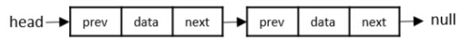
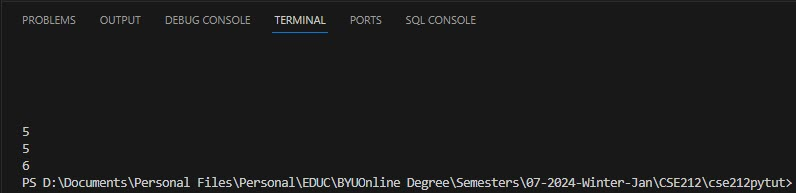

# Trees

A tree data structure is similar to a linked list in that its nodes are connected together using pointers. However, unlike a linked list that can only point to a single node in any direction, a tree can point to multiple nodes.



Doubly linked lists (source: [tutorialspoint](https://www.tutorialspoint.com/data_structures_algorithms/linked_list_algorithms.htm))


Sample of a tree

## Types of Trees

1. Binary tree
2. Binary search trees
3. Balanced binary search tree

### 1. Binary Tree

#### Characteristics
* Is not linked to more than two nodes.
* The top node is the **root** node.
* Any node that does not connect to another node is called a **leaf** node.
* A node connected to one or more nodes is called a **parent**.
* A node that is connected to the parent are called **child** nodes.
* Nodes to the left and right of any parent node form a **subtree**.

    

### 2. Binary Search Tree (BST)

#### Characteristics
* It conforms with the rules for the data put into it.
* Data is first compared with the data in the parent node.
* If the data to be added is greater than the value at the parent node, the data to be added is inserted in the left subtree.
* Otherwise, it is inserted in the right subtree.
* If duplicates values are authorized in the tree, the duplicate value may go to the left or right subtree.
* At the end of this process, the data in the tree is sorted.

    

### 3. Balanced Binary Search Tree (BBST)

A key determining factor in a BBST is the height between any two subtrees. It must not be significantly different. By height, we mean the maximum number of nodes between root and the leaves.

#### Tree Review


## Practical Uses of Trees in Real World Applications

- Plotting point.
- Usage in compiler design.
- Indexing in databases.
- Priorty queue.
- Web search engines.
- Storage of elements.
- XML/HTML data.
- Decision-making and Analysis.
- Finding Minimum Cost.
- File system.
- Searching for key.

## Implementing Trees in Python

As with linked lists, Python does not have a built-in BST class. Trees are implemented in Python using self-built classes. Some developers have written packages (such as bintrees) that may be used for implementation of trees in Python. However, such are outside the scope of this course.

The common functions that need to the created in a BST are:

| BST Operation    | Linked List                                      |
|------------------|--------------------------------------------------|
| insert(value)    | Insert a value into the tree.                    |
| remove(value)    | Remove a value from the tree.                    |
| contains(value)  | Check if a value is in the tree.                 |
| traverse_forward | Go through all objects from smallest to largest. |
| traverse_reverse | Go through all objects from largest to smallest. |
| height(node)     | Calculate the height of a node.                  |
| size()           | Return the size of the BST.                      |
| empty()          | Returns true if the root node is empty.          |
|                  | It can also be done be checking the size for 0.  |

The structure of a tree necessitates that certain steps be repeated when performing any of its operations. This is why recursion will be used in performing most of the operations in our tree functions. 

### Creating an empty tree

In the code below, we create a class named Linkedlist. This class will hold our entire list. Inside the LinkedList class, we create the node class also called Node. This is an inner class to the parent class, LinkedList, and will be accessed with the notation LinkedList.Node. The \_\_init\_\_ constructor in the Node class initialise the node to the data that is provided to it and also sets the previous and next pointers to None. In the \_\_init\_\_ constructor in the LinkedList class, the head and tail nodes are set to None. 

```python
class BST:
    """
    This BST class will implement our tree structure and house
    all the necessary functions. - tr_code01.py
    """
    class Node:

        # creates a class Node for each node in the tree with a left and right pointer.
        def __init__(self, data):
       
            self.data = data
            self.left = None
            self.right = None

    def __init__(self):
        # Initialize an empty BST.
        self.root = None
```

This class is similar to the one we used in implementing our linked list in an earlier tutorial. However, not that each node has a left and a right pointer.

### Inserting Nodes into the Tree

Our tree, myTree, is presently empty. Inserting our first node means that we are inserting the root node of the tree. We have defined a function, insert_head, in our BST class to add nodes at the head of the list.

**Note:** In practising these codes, remember they are cumulative i.e. each new chunk of code builds on the previous. So, remember to include the previous codes when testing new codes except where so indicated.

```python
# Adds the first node (root) into a linked list - tr_code02.py

    def insert(self, data):
        # This functions inserts "data" into the BST.
        # If the BST is empty, it will simply set the root to the new node.
        # Otherwise, it will search the tree recursively (using the _insert function)
        # to location the correct insertion point.
        if self.root is None:
            self.root = BST.Node(data)
        else:
            # Begin searching at the root
            self._insert(data, self.root)  

    def _insert(self, data, node):
        # This function, called by the insert function, searches and find the place to 
        # insert the new node with "data" inside it.

        # Check if the data exists. If yes, return.
        if data == node.data:
            return
        
        if data < node.data:
            # The data goes to the left side.
            if node.left is None:
                # The position is empty and the node can be inserted here.
                node.left = BST.Node(data)
            else:
                # Continue searching using the _insert function
                # recursively on the left sub-tree.
                self._insert(data, node.left)
        else:
            # The data goes to the right side.
            if node.right is None:
                # The position is empty and the node can be inserted here.
                node.right = BST.Node(data)
            else:
                # Continue searching using the _insert function
                # recursively on the right sub-tree.
                self._insert(data, node.right)
```

Having created these insert functions, we are now read to insert our first nodes into the tree. Note, we have inserted the __iter_ constructor (which calls the _traverse-forward function) to enable use print out the contents of our tree.

```python
    def __iter__(self):
        # This function is a generator function. It carries out a forward traversal beginning from the root
        # of BST. It is called when a for loop is performed.
        yield from self._traverse_forward(self.root)  # Start at the root
        
    def _traverse_forward(self, node):
        # See the code file, tr_code02.py, for notes on this function
        if node is not None:
            yield from self._traverse_forward(node.left)
            yield node.data
            yield from self._traverse_forward(node.right)

# create a tree named myTree
myTree = BST()

# insert nodes with data
myTree.insert(6)
myTree.insert(2)
myTree.insert(10)

for x in myTree:
    print(x)
```

Output:


### Traversing a Tree

We shall now demonstrate how to search for a value within a tree. Two functions, __contains___ and _contains, will enable us to carry out our objective.

```python
    # The two functions below work together to enable us to search for value inside our tree.

    def __contains__(self, data):
        # This function allows to check if a value is present in the tree

        return self._contains(data, self.root)  # Begin at the root

    def _contains(self, data, node):
        # This function is called by the __contains__ function.
        # It searches for a node that contains the "data".
        if not node:
            return False
        if node.data == data:
            return True
        if node.data > data:
            return self._contains(data, node.left)
        return self._contains(data, node.right)

# create a tree named myTree
myTree = BST()

# insert nodes with data
myTree.insert(6)
myTree.insert(2)
myTree.insert(10)
myTree.insert(19)
myTree.insert(26)
myTree.insert(4)
myTree.insert(17)
myTree.insert(10)
myTree.insert(29)

print(10 in myTree) # True
print(245 in myTree) # False
print(29 in myTree) # True
print(6 in myTree) # True
```

Output:


```python
    # tr_code04.py
    def get_height(self):
        # If the tree is empty, then return 0.  Otherwise, call 
        # _get_height on the root which will recursively determine the 
        # height of the tree.
        if self.root is None:
            return 0
        else:
            return self._get_height(self.root)  # Begin at the root

    def _get_height(self, node):
        # This function is called by the get_height function

        if node.left and node.right:
            return 1 + max(self._get_height(node.left), self._get_height(node.right))
        elif node.left:
            return 1 + self._get_height(node.left)
        elif node.right:
            return 1 + self._get_height(node.right)
        else:
            return 1

# create a tree named myTree
myTree = BST()

# insert nodes with data
myTree.insert(6)
myTree.insert(2)
myTree.insert(10)
myTree.insert(19)
myTree.insert(26)
myTree.insert(4)
myTree.insert(17)
myTree.insert(10)
myTree.insert(29)

print(myTree.get_height())
myTree.insert(6)
print(myTree.get_height())
myTree.insert(112)
print(myTree.get_height())
```

Output:



## Exercises

Write a Python program to find the closest value to a given target value in a given non-empty Binary Search Tree (BST) of unique values.

<details closed>
<summary>Solution to exercise</summary>

```python
class TreeNode(object):
def __init__(self, x):
    self.val = x
    self.left = None
    self.right = None

def closest_value(root, target):
a = root.val
kid = root.left if target < a else root.right
if not kid:
    return a
b = closest_value(kid, target)
return min((a,b), key=lambda x: abs(target-x))

root = TreeNode(8)  
root.left = TreeNode(5)  
root.right = TreeNode(14) 
root.left.left = TreeNode(4)  
root.left.right = TreeNode(6) 
root.left.right.left = TreeNode(8)  
root.left.right.right = TreeNode(7)  
root.right.right = TreeNode(24) 
root.right.right.left = TreeNode(22)  

result = closest_value(root, 19)
print(result)
```
</details>

## Complexity

Complexity defines how easy or difficult a problem or a solution is. It is measured in two ways: (a) time complexity, and (b) space complexity. Time complexity measure the time it takes to execute an operation on a data structure, while space complexity messures the amount of storage or memory space it takes to store the data structure. The complexity of a tree is shown in the table below:

| BST Operation    | Performance |
|------------------|-------------|
| insert(value)    | O(log n)    |
| remove(value)    | O(log n)    |
| contains(value)  | O(log n)    |
| traverse_forward | O(n)        |
| traverse_reverse | O(n)        |
| height(node)     | O(n)        |
| size()           | O(1)        |
| empty()          | O(1)        |


## Summary

A tree data structure is a hierarchical organization of data elements, where each element, referred to as a node, is connected to other nodes through links called edges. This structure is commonly used in computer science and programming to represent and store information in a way that allows for efficient access and manipulation.

In a tree, one node is designated as the root, and it serves as the starting point for traversing the structure. The nodes connected to the root are called its children, while the node connected to a given node is known as its parent. Nodes without any children are called leaves. The height of a tree is the longest path from the root to a leaf node.

Trees can be classified into different types based on their properties, such as binary trees, where each node has at most two children, and balanced trees, which ensure that the difference in depth between the left and right subtrees is no more than one. Trees can also be used to represent various data structures, including graphs, file systems, and family trees.

Tree data structures are essential in many algorithms and data processing tasks, such as searching, sorting, and traversing. They provide an efficient way to organize and access data while maintaining a clear hierarchy, making them a valuable tool in computer science and programming.

## Further Reading

- [Wikipedia, Tree (Data Structure)](https://en.wikipedia.org/wiki/Tree_(data_structure))
- [TutorialsPoint, Tree Data Structure.](https://www.tutorialspoint.com/data_structures_algorithms/tree_data_structure.htm)


[Back to Welcome Page](0-welcome.md)